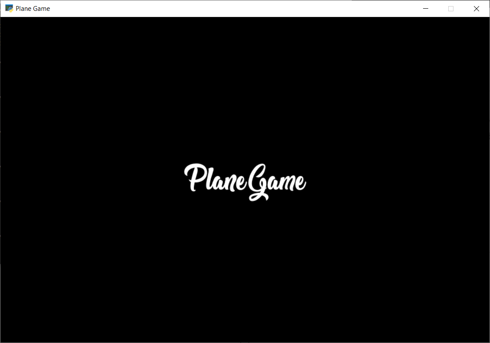
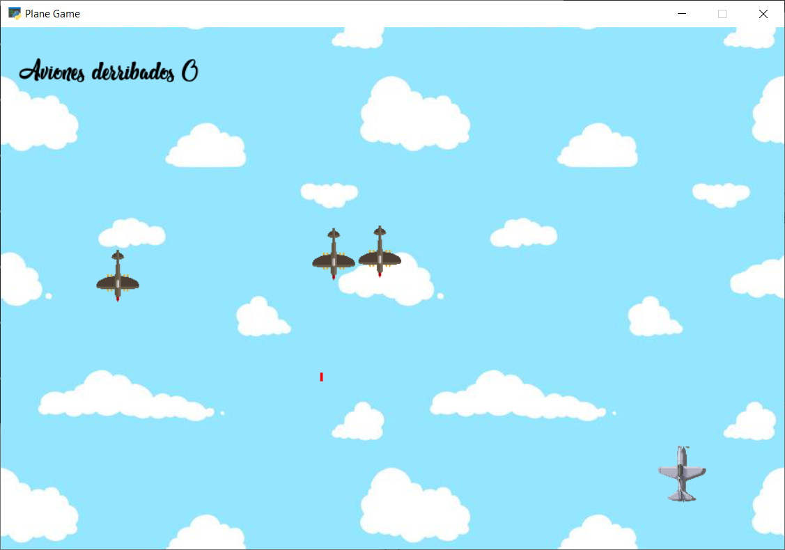

<a name="readme-top"></a>

[![Contributors][contributors-shield]][contributors-url]
[![Forks][forks-shield]][forks-url]
[![Stargazers][stars-shield]][stars-url]
[![Issues][issues-shield]][issues-url]
[![MIT License][license-shield]][license-url]
[![LinkedIn][linkedin-shield]][linkedin-url]


<!-- PROJECT LOGO -->
<br />
<div align="center">
  <a href="https://github.com/pacoDevelop/planeGame">
    
  </a>

<h3 align="center">PlaneGame</h3>

  <p align="center">
	Juego elaborado con python y la librería pygame en el curso 2018-2019 de Desarrollo de aplicaciones Multiplataforma.
    <br />
    <a href="https://github.com/pacoDevelop/planeGame"><strong>Explorar documentación »</strong></a>
    <br />
    <br />
    <a href="https://github.com/pacoDevelop/planeGame">View Demo</a>
    ·
    <a href="https://github.com/pacoDevelop/planeGame/issues">Report Bug</a>
    ·
    <a href="https://github.com/pacoDevelop/planeGame/issues">Request Feature</a>
  </p>
</div>


<!-- TABLE OF CONTENTS -->
<details>
  <summary>Table of Contents</summary>
  <ol>
    <li>
      <a href="#about-the-project">About The Project</a>
      <ul>
        <li><a href="#built-with">Built With</a></li>
      </ul>
    </li>
    <li>
      <a href="#getting-started">Getting Started</a>
      <ul>
        <li><a href="#prerequisites">Prerequisites</a></li>
        <li><a href="#installation">Installation</a></li>
      </ul>
    </li>
    <li><a href="#usage">Usage</a></li>
    <li><a href="#roadmap">Roadmap</a></li>
    <li><a href="#contributing">Contributing</a></li>
    <li><a href="#license">License</a></li>
    <li><a href="#contact">Contact</a></li>
    <li><a href="#acknowledgments">Acknowledgments</a></li>
  </ol>
</details>


<!-- ABOUT THE PROJECT -->
## About The Project
<div align="center">

 <br />
 <br />
Este juego fue elaborado en la materia de Entornos de Desarrollo en el curso de Desarrollo de aplicaciones multiplataforma 2018-2019. Consta de un juego simple de aviones, dispone de sonido y movimiento en 2D.
 <br />
 <br />

https://user-images.githubusercontent.com/70912492/185476514-77294383-0e61-4938-9b5b-7968defd8cce.mp4


</div>
<p align="right">(<a href="#readme-top">Volver arriba</a>)</p>


### Built With

* [![Python][Python3]][Python-url]

<p align="right">(<a href="#readme-top">Volver arriba</a>)</p>


<!-- GETTING STARTED -->
## Getting Started

 Para obtener una copia local en funcionamiento, siga estos sencillos pasos de ejemplo.

### Prerequisites

Este es un ejemplo de cómo enumerar las cosas que necesita para usar el software y cómo instalarlas.
* Python3
	* Saber si tienes python 3 instalado
		* Linux/Mac
			* En una terminal escribir y devolverá la versión que tenemos.
				``` sh
				python --version
				```
		* Windows
			* En una terminal escribir y devolverá la versión que tenemos.
				``` sh
				py --version
				```
			
### Installation

1. Instala python3 [https://www.python.org/downloads/](https://www.python.org/downloads/)
2. Clona el repositorio y abrimos un terminal en esa ruta.
   ```sh
   git clone https://github.com/pacoDevelop/planeGame.git
   ```
3. Instala los requerimientos
   ```sh
   pip install -r requirements.txt
   ```
4. Ejecuta  `main.py`
   ```sh
   py main.py ó python main.py
   ```
5. Según el procesador que tengas modifica, la variable speed_game  del archivo  `Settings.py`
<p align="right">(<a href="#readme-top">Volver arriba</a>)</p>


<!-- USAGE EXAMPLES -->
## Usage

Según el procesador el juego irá diferente en cada procesador, para ello hay una variable que modificándola se puede adaptar a cada procesador.


<p align="right">(<a href="#readme-top">Volver arriba</a>)</p>


<!-- ROADMAP -->
## Roadmap
- [x] Aplicado colisiones de aviones
- [x] Rotación de enemigos
- [x] Movimiento mas fluido
- [x] Parada de movimiento para disparos
- [x] Scroll infinito de aviones hasta colisión con avioneta o bala
- [x] Disparos enemigos añadidos(Disparos hasta un límite del total de enemigos)
- [x] Balas de enemigos borradas al llegar al final(Bug corregido no borraba balas)
- [x] Disparos salen de la punta de la nave del enemigo
- [x] Intro añadida
- [x] Música añadida
- [x] Efectos añadidos
- [x] Puntuación y scoreboard añadidos
- [x] si hay contacto entra balas enemigos o naves enemigas con la nave jugador saca mensaje.
- [ ] Actualizar con explosión contacto bala-nave
- [ ] Apariciones de naves mas reales

Consulte los [open issues](https://github.com/pacoDevelop/planeGame/issues) para obtener una lista completa de las características propuestas (y los problemas conocidos).
<p align="right">(<a href="#readme-top">Volver arriba</a>)</p>


<!-- CONTRIBUTING -->
## Contributing
Las contribuciones son lo que hace que la comunidad de código abierto sea un lugar increíble para aprender, inspirar y crear. Cualquier contribución que hagas es **muy apreciada** .

Si tiene una sugerencia que mejoraría esto, bifurque el repositorio y cree una solicitud de extracción. También puede simplemente abrir un problema con la etiqueta "mejora". ¡No olvides darle una estrella al proyecto! ¡Gracias de nuevo!

1. Fork the Project
2. Create your Feature Branch (`git checkout -b feature/AmazingFeature`)
3. Commit your Changes (`git commit -m 'Add some AmazingFeature'`)
4. Push to the Branch (`git push origin feature/AmazingFeature`)
5. Open a Pull Request

<p align="right">(<a href="#readme-top">Volver arriba</a>)</p>


<!-- LICENSE -->
## License

Distribuido bajo la licencia GNU General Public License v3.0 . Mire `LICENSE.txt` para obtener más información.

<p align="right">(<a href="#readme-top">Volver arriba</a>)</p>


<!-- CONTACT -->
## Contact

pacoDevelop - [@pacohernandezsa](https://twitter.com/pacohernandezsa) - franciscohernandezsantos3@gmail.com

Project Link: [https://github.com/pacoDevelop/planeGame](https://github.com/pacoDevelop/planeGame)

<p align="right">(<a href="#readme-top">Volver arriba</a>)</p>


<!-- ACKNOWLEDGMENTS -->
## Acknowledgments

* [https://img.shields.io](https://img.shields.io)


<p align="right">(<a href="#readme-top">Volver arriba</a>)</p>


<!-- MARKDOWN LINKS & IMAGES -->
<!-- https://www.markdownguide.org/basic-syntax/#reference-style-links -->
[contributors-shield]: https://img.shields.io/github/contributors/pacoDevelop/planeGame.svg?style=for-the-badge
[contributors-url]: https://github.com/pacoDevelop/planeGame/graphs/contributors
[forks-shield]: https://img.shields.io/github/forks/pacoDevelop/planeGame.svg?style=for-the-badge
[forks-url]: https://github.com/pacoDevelop/planeGame/network/members
[stars-shield]: https://img.shields.io/github/stars/pacoDevelop/planeGame.svg?style=for-the-badge
[stars-url]: https://github.com/pacoDevelop/planeGame/stargazers
[issues-shield]: https://img.shields.io/github/issues/pacoDevelop/planeGame.svg?style=for-the-badge
[issues-url]: https://github.com/pacoDevelop/planeGame/issues
[license-shield]: https://img.shields.io/github/license/pacoDevelop/planeGame.svg?style=for-the-badge
[license-url]: https://github.com/pacoDevelop/planeGame/blob/master/LICENSE.txt
[linkedin-shield]: https://img.shields.io/badge/-LinkedIn-black.svg?style=for-the-badge&logo=linkedin&colorB=555
[linkedin-url]: https://linkedin.com/in/francisco-hernandez-santos
[product-screenshot]: images/screenshot.png
[Next.js]: https://img.shields.io/badge/next.js-000000?style=for-the-badge&logo=nextdotjs&logoColor=white
[Python3]: https://img.shields.io/badge/python-3670A0?style=for-the-badge&logo=python&logoColor=ffdd54
[Next-url]: https://nextjs.org/
[Python-url]: https://python.org/
[React.js]: https://img.shields.io/badge/React-20232A?style=for-the-badge&logo=react&logoColor=61DAFB
[React-url]: https://reactjs.org/
[Vue.js]: https://img.shields.io/badge/Vue.js-35495E?style=for-the-badge&logo=vuedotjs&logoColor=4FC08D
[Vue-url]: https://vuejs.org/
[Angular.io]: https://img.shields.io/badge/Angular-DD0031?style=for-the-badge&logo=angular&logoColor=white
[Angular-url]: https://angular.io/
[Svelte.dev]: https://img.shields.io/badge/Svelte-4A4A55?style=for-the-badge&logo=svelte&logoColor=FF3E00
[Svelte-url]: https://svelte.dev/
[Laravel.com]: https://img.shields.io/badge/Laravel-FF2D20?style=for-the-badge&logo=laravel&logoColor=white
[Laravel-url]: https://laravel.com
[Bootstrap.com]: https://img.shields.io/badge/Bootstrap-563D7C?style=for-the-badge&logo=bootstrap&logoColor=white
[Bootstrap-url]: https://getbootstrap.com
[JQuery.com]: https://img.shields.io/badge/jQuery-0769AD?style=for-the-badge&logo=jquery&logoColor=white
[JQuery-url]: https://jquery.com 
